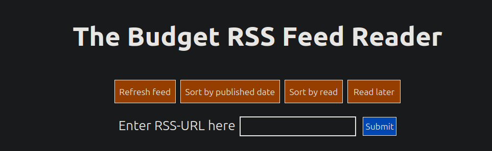
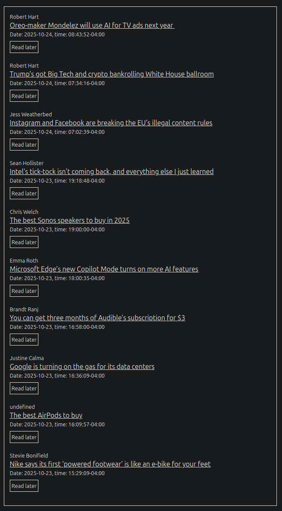

# Budget RSS Feed Reader

 

  <h3 align="center">    <a href="https://bfr.mikilamberg.com"><strong>https://bfr.mikilamberg.com</strong></a></h3>

 

  
Table of Contents

  <ol>
    <li>
      <a href="#about-the-project">About The Project</a>
      <ul>
        <li><a href="#built-with">Built With</a></li>
            <li><a href="#how-it-works">How It Works</a></li>
      </ul>
    </li>
    <li>
      <a href="#getting-started">Getting Started</a>
      <ul>
        <li><a href="#prerequisites">Prerequisites</a></li>
        <li><a href="#installation">Installation</a></li>
      </ul>
    </li>
    <li><a href="#license">License</a></li>
    <li><a href="#contact">Contact</a></li>
    <li><a href="#acknowledgments">Acknowledgments</a></li>
  </ol>

## About The Project

My take on a simple feed reader. Why look into other feed readers when you can dive in and try to build one yourself?

### Built With

This project was built with the following tech stack.

[![JavaScript][JavaScript]][JavaScript-url]
[![Tailwind CSS][Tailwind CSS]][TailwindCSS-url]
[![Node.js][Node.js]][Node.js-url]
[![Express.js][Express.js]][Express-url]
[![Nginx][Nginx]][Nginx]
[![Docker][Docker]][Docker]

### How It Works

Budget RSS Feed Reader is built for simplicity. Simply enter the URL from your desired RSS Feed and your content will load instantly.

## Getting Started

### Prerequisites

- [Docker](https://www.docker.com/get-started)
- [Docker Compose](https://docs.docker.com/compose/)

### Installation

1. Clone the repo:

`git clone https://github.com/lambergmiki/Budget-RSS-Feed-Reader`

2. `cd budget-feed-reader`
3. `docker compose up --build -d`
4. Check that the container is running: `docker compose ps`
5. To stop the container, type `docker stop <container-ID>`.

---

By default the app will be available at: http://localhost:3000 <- make sure the port is free on your machine!

## License

Distributed under the MIT License. See `LICENSE.txt` for more information.

## Contact

Did you find bugs that are not yet listed as [issues](https://github.com/lambergmiki/Budget-RSS-Feed-Reader/issues), or do you simply want a chat? E-mail me or send me a DM on LinkedIn (both can be found at the top of this README!).

## Acknowledgments

Thanks to the following individuals and organisations for contributing to my project in one way or another.

- [Andreas Eriksson](https://github.com/AN-Eriksson) ➔ for once again helping me out with deployment and pesky server settings.
- [Miniflux](https://miniflux.app/)
- [README template by othneildrew](https://github.com/othneildrew)
- [Choose an Open Source License](https://choosealicense.com)
- [Img Shields](https://shields.io)
- [Simple Icons](https://github.com/simple-icons/simple-icons)

(<a href="#readme-top">back to top</a>)

<!-- MARKDOWN LINKS & IMAGES -->
<!-- https://www.markdownguide.org/basic-syntax/#reference-style-links -->

[license-shield]: https://img.shields.io/badge/MIT-green?style=for-the-badge
[MIT License]: https://img.shields.io/badge/License-MIT-green?style=for-the-badge
[license-url]: https://github.com/lambergmiki/matgeneratorn/blob/main/LICENSE.txt
[linkedin-shield]: https://img.shields.io/badge/LinkedIn-0077B5?style=for-the-badge&logo=linkedin&logoColor=white
[linkedin-url]: https://www.linkedin.com/in/lambergmiki
[JavaScript]: https://img.shields.io/badge/JavaScript-F7DF1E?style=for-the-badge&logo=javascript&logoColor=black
[JavaScript-url]: https://developer.mozilla.org/en-US/docs/Web/JavaScript
[Node.js]: https://img.shields.io/badge/Node.js-339933?style=for-the-badge&logo=nodedotjs&logoColor=white
[Node.js-url]: https://nodejs.org/
[Express.js]: https://img.shields.io/badge/Express.js-000000?style=for-the-badge&logo=express&logoColor=white
[Express-url]: https://expressjs.com/
[Tailwind CSS]: https://img.shields.io/badge/Tailwind_CSS-38B2AC?style=for-the-badge&logo=tailwind-css&logoColor=white
[TailwindCSS-url]: https://tailwindcss.com/
[Nginx]: https://img.shields.io/badge/Nginx-009639?logo=nginx&logoColor=white&style=for-the-badge
[Docker]: https://img.shields.io/badge/docker-257bd6?style=for-the-badge&logo=docker&logoColor=white
