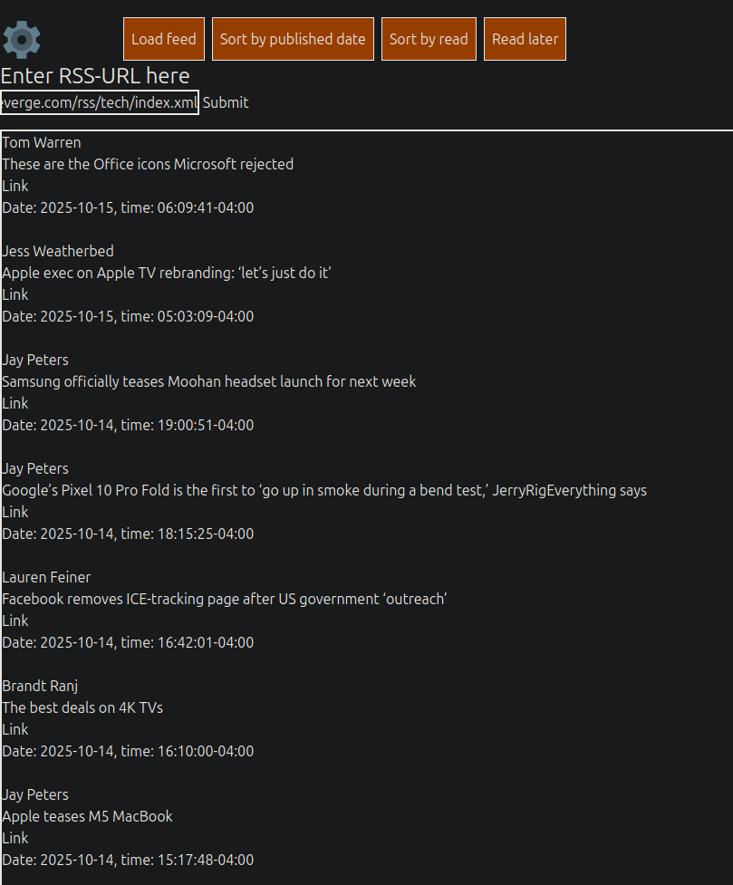
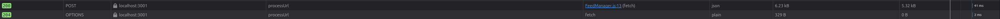
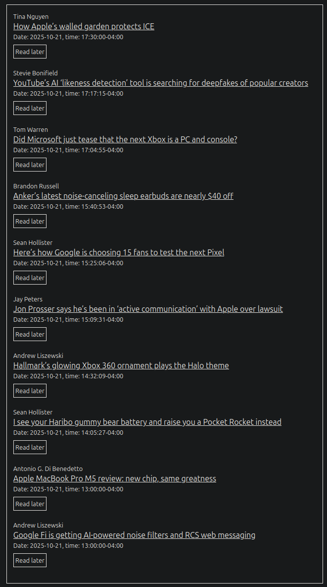
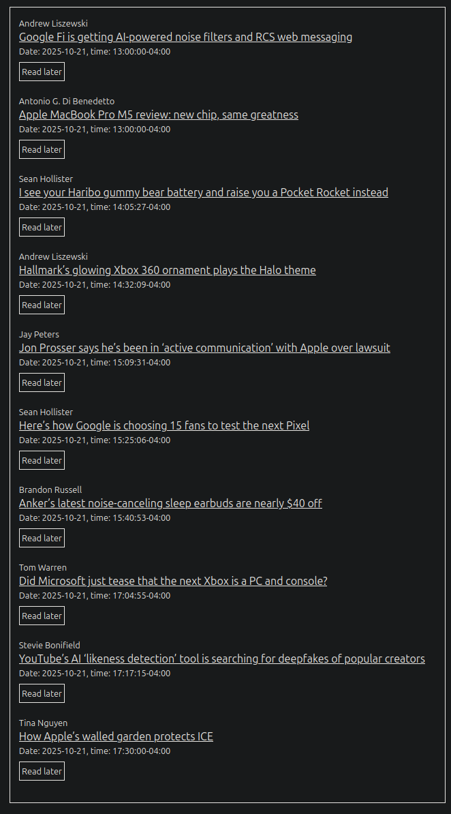
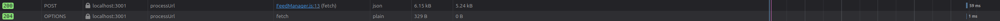
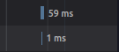

# A Few Manual Tests of The Budget RSS Feed Reader

 

## Test Cases

_Notice: A pre-requisite of all tests is that you have navigated to the homepage of the application._

---

### Test Case #1 — Generating an RSS Feed

**Date:** 2025-10-15
**Module Version:** 0.0.1

**Test Environment:**

- Visual Studio Code: 1.104.3
- Node.js: 22.18.0
- OS: Linux x64 6.8.0-85-generic
- Distribution: Linux Mint, Cinnamon 22.1
- Browser: Mozilla Firefox 143.0.3 (64-bit)

**Description:**
When an RSS URL is pasted into the text field and "Submit" is clicked, a typical RSS feed should be generated in the "content box" just below.

**Steps:**

1. Paste a valid RSS URL (Atom or RSS format) into the field labeled "Enter RSS-URL here".
2. Click "Submit".

**Expected Result:**
A feed should immediately appear in the "content box" below the "Submit" button.

**Status:**   
**Comments:** Works perfectly.  
**Misc.:**  

---

### Test Case #2 — Refresh currently loaded feed

**Date:** 2025-10-21
**Module Version:** 0.1.0

**Test Environment:**
Same as Test Case 1

**Description:**
When "Refresh feed" in the menu is clicked, the currently loaded feed will be updated and new content loaded if there is new content since latest fetch.

**Steps:**
If a feed is already loaded from before, skip steps 1-2 and go straight to step 3.

1. Paste a valid RSS URL (Atom or RSS format) into the field labeled "Enter RSS-URL here".
2. Click "Submit".
3. Click "Refresh feed"

**Expected Result:**
New articles will load into the feed if there are any. Otherwise the "Network" tab in Dev Tools (F12) will just show a fetch with a status 200.

**Status:**   
**Comments:**
**Misc.:**

---

### Test Case #3 — Sort feed by date

**Date:** 2025-10-22
**Module Version:** 0.1.0

**Test Environment:**
Same as above

**Description:**
Test to see that the feed is sorted based on when the articles were published (date & time) - ascending or descending is toggled with a click on the "Sort by read"-button.

**Steps:**

1. Ensure a feed has been loaded.
2. Click on "Sort by read"

**Expected Result:**
The feed should now be in reverse order, oldest -> most recent as opposed to most recent -> oldest. 

### Pre-sort:

### Post-sort:

**Status:**   
**Comments:**
**Misc.:**

---

### Test Case #4 - Performance

**Date:** 2022-10-22
**Module Version:** 0.1.0

**Test Environment:**
Same as above.

**Description:**
Test the amount of time a feed fetch takes - in other words, how long does it take before the feed is rendered once the user has clicked "Submit".

**Steps:**

1. Open Dev Tools (F12)
2. Click the "Network" tab
3. Paste a valid RSS URL (Atom or RSS format) into the field labeled "Enter RSS-URL here".
4. Click "Submit".
5. Identify the the most recent `POST` and `OPTIONS` calls in the `Method` column.

**Expected Result:**
They should return a 200 and 204 status code respectively. To the far right you can see how long the actual calls took - in this case, a total of 60ms. Expected result is less than <200ms according to the requirements specification. _Lightning fast!_

**Status:**   
**Comments:**  
**Misc.:**

---

## Summary (Test report)

#### Total Number of Tests: 4

#### Successful Tests: [4 / 4]

#### Test Strategy:

Simple manual tests designed to help prioritize aspects such as functionality, presentation, reflection, and code quality in the app. Read more on my reflection around test in the Wiki of this project, page named `Reflection`.
